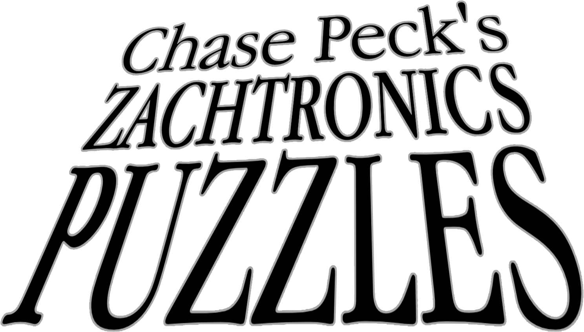

# zachtronics-puzzles

---

## **TIS-100**
- [Binary to Decimal](https://gist.githubusercontent.com/chasepeck/7d581d525cc2145511353066a39f1549/raw/acc9fcbf3acff45294b1aa858994084e8281b030/tis100-binary_to_decimal) - *Difficulty **4/5*** - [*Solution*](https://youtu.be/UMF7xP0ETwk)
- [Decimal to Binary](https://gist.githubusercontent.com/chasepeck/199b11b51b78f162977f2996ff54a4dd/raw/1eaa9c55c6fca3711e40b8e1bd7f94dab6d84f2b/tis100-decimal_to_binary) - *Difficulty **4/5*** - [*Solution*](https://youtu.be/_IYgBxsYNGA)

To install a TIS-100 puzzle, copy the code from the link given, go into the TIS-100 Specification Editor, and click *Import Specification From Clipboard*.

---

## **EXAPUNKS**
- [Googolplex Advertising®](https://steamcommunity.com/sharedfiles/filedetails/?id=2560401868) - *Difficulty **2/5*** - [*Solution*](https://youtu.be/dM1yfa4Kf4M)

---
